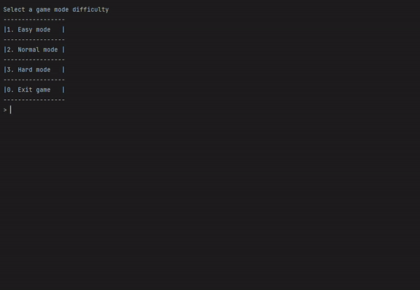

# Typing Speed Application

 

This console-based Java application is designed to enhance your typing speed by measuring your words per minute (WPM) and time elapsed under different difficulty settings.

## Total Development Period

03-17-202 ~ 03-30-2023

## Tech Stack

## Project Objectives

### Learn the basics of Java:

The primary goal of this project was to demonstrate the transferability of fundamental programming principles across different languages.

## Features

### Easy mode:

Warm up your typing skills with a simple sentence.

### Normal mode:

Challenge yourself with a word bank comprising over 20 medium-difficulty programming-related words. The words are randomly arranged each time you run the program.

### Hard mode:

Test your typing skills with a word bank containing over 20 hard-difficulty programming-related words. Like in Normal Mode, the words are shuffled for a fresh challenge every time.

### Example functionality

## Project Challenges

- Learning a new language involves understanding its environment and syntax, which took some time to grasp.

## Project Takeaways

Throughout this project, drawing from my background in C++, I effectively applied object-oriented programming concepts, notably inheritance and polymorphism, to navigate learning Java. By implementing a base class, GameMode, and designing a hierarchical structure for derived classes such as Easy Mode, Normal Mode, and Hard Mode, I was able get up to speed with where my programming capabilities are despite Java being a new language.
